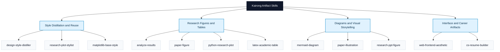

# Kairong Artifact Skills

Skills for designing high-quality research and technical artifacts.

Kairong Artifact Skills is a personal Codex skill library for turning complex technical content into outputs that are clear, professional, and visually intentional. The shared theme is not just "research tooling." It is design-driven technical communication: charts, tables, diagrams, slides, interfaces, and resumes that need strong hierarchy, visual consistency, and finished taste.

This repo is optimized for Kairong's own workflow and aesthetic standards. It is not a one-size-fits-all automation pack. It is a reusable skill system for people who care about how technical work is expressed, not only how it is computed.

Current GitHub path: `LKRCharon/kairong-skills`
Recommended display name: `Kairong Artifact Skills`
Recommended repo rename: `kairong-artifact-skills`
Repository changelog: `CHANGELOG.md`

## Identity

What ties these skills together:

- Clarity: make dense technical information easier to read and understand.
- Professional polish: produce outputs suitable for papers, talks, demos, and hiring materials.
- Aesthetic control: encode layout, spacing, color, typography, and restraint as reusable heuristics.
- Reusable style knowledge: distill taste into prompts, tokens, templates, and scripts.

In short, this repository is a design-oriented skill system for research and technical expression.

## Design Principles

- Design first: outputs should communicate well and look intentional.
- Reproducible taste: script repeatable steps whenever possible, then capture subjective judgment as explicit heuristics.
- Private reference, open distillation: keep raw inspiration local; commit only abstracted style knowledge that is safe to share.
- Progressive disclosure: keep `SKILL.md` concise and move detail into `references/`, `scripts/`, and `assets/`.
- Personal voice matters: the point is not neutral defaults, but a consistent point of view that can be reused.

## Versioning and Releases

- Every installable skill declares its version in the frontmatter of its `SKILL.md`.
- Bump a skill version whenever you make a user-visible workflow, interface, or output change.
- Record every published update in `CHANGELOG.md`, even if the change only affects one skill.
- Prefer publishing and installing from Git tags or GitHub releases in the `vX.Y.Z` format.
- Treat `main` as the latest development branch, not the default stable distribution target.

## Reference Learning Boundary

This repo is built around a strict split between private inputs and open outputs.

Keep local only:

- Third-party screenshots, PDFs, slides, webpages, and design files used as inspiration
- Any raw asset that should not be redistributed
- Intermediate notes that are only useful because they point back to a private source

Commit to the repo:

- Style cards
- Layout rules and extraction rubrics
- Design tokens and palette roles
- Transfer briefs for downstream generation skills
- Reusable scripts, templates, and schemas

This boundary is what makes `design-style-distiller` important: it turns private reference material into reusable, open-safe style knowledge.

## Skill Atlas

This repo works best when read as a capability map, not a flat list.

### Capability Map



### Tree Navigation

```text
Kairong Artifact Skills
├── Style Distillation and Reuse
│   ├── design-style-distiller
│   ├── research-plot-stylist
│   └── matplotlib-base-style
├── Research Figures and Tables
│   ├── analyze-results
│   ├── paper-figure
│   ├── python-research-plot
│   └── latex-academic-table
├── Diagrams and Visual Storytelling
│   ├── mermaid-diagram
│   ├── paper-illustration
│   └── research-ppt-figure
└── Interface and Career Artifacts
    ├── web-frontend-aesthetic
    └── cs-resume-builder
```

### Choose by Goal

| If you want to... | Start with | Then pair with |
| --- | --- | --- |
| Learn from a strong visual reference without committing raw assets | `design-style-distiller` | `research-plot-stylist`, `paper-illustration`, `web-frontend-aesthetic` |
| Turn experiment logs into publishable charts | `analyze-results` | `paper-figure`, `research-plot-stylist`, `matplotlib-base-style` |
| Standardize plot aesthetics across a paper | `matplotlib-base-style` | `python-research-plot`, `paper-figure` |
| Draft a system or pipeline figure quickly | `mermaid-diagram` | `paper-illustration`, `research-ppt-figure` |
| Build a polished final paper figure | `paper-figure` | `latex-academic-table`, `python-research-plot` |
| Create slide visuals with stronger storytelling | `research-ppt-figure` | `mermaid-diagram`, `paper-illustration` |
| Build a distinctive interface or portfolio-like page | `web-frontend-aesthetic` | `design-style-distiller` |
| Turn profile material into a professional resume | `cs-resume-builder` | `design-style-distiller` |

### Skill Notes

- `design-style-distiller`: distill visual references into reusable style cards, transfer briefs, and open-safe aesthetic rules.
- `research-plot-stylist`: infer plot style from scientific references and generate runnable plotting code.
- `matplotlib-base-style`: store and reapply one decomposed plotting baseline for consistent visual output.
- `analyze-results`: turn raw experiment logs into structured summaries, rankings, and delta tables.
- `paper-figure`: integrate result analysis, figure planning, reproducible scripts, and LaTeX inclusion.
- `python-research-plot`: general-purpose publication and presentation plotting in Python.
- `latex-academic-table`: produce clean academic tables with readable numeric alignment and paper-ready structure.
- `mermaid-diagram`: draft editable system and pipeline diagrams quickly in Mermaid.
- `paper-illustration`: create polished architecture and method figures with review-driven refinement.
- `research-ppt-figure`: design talk visuals, concept figures, and slide storytelling assets.
- `web-frontend-aesthetic`: build frontend pages and prototypes with distinct visual direction.
- `cs-resume-builder`: turn profile notes and project records into professional Chinese and English resumes.

## Repository Layout

```text
kairong-skills/
├── README.md
├── .gitignore
├── scripts/
│   └── new_skill.sh
├── templates/
│   └── SKILL.template.md
└── skills/
    ├── analyze-results/
    ├── cs-resume-builder/
    ├── design-style-distiller/
    ├── latex-academic-table/
    ├── matplotlib-base-style/
    ├── mermaid-diagram/
    ├── paper-figure/
    ├── paper-illustration/
    ├── python-research-plot/
    ├── research-plot-stylist/
    ├── research-ppt-figure/
    └── web-frontend-aesthetic/
```

## Recommended Workflow

For a paper or technical artifact that needs both rigor and finish:

1. Use `design-style-distiller` to turn private references into reusable style cards and transfer briefs.
2. Use `analyze-results` to normalize results and produce rankings, deltas, and table-ready summaries.
3. Use `paper-figure` to define the figure plan and wire up reproducible outputs.
4. Use `research-plot-stylist` and `matplotlib-base-style` to lock visual consistency across plots.
5. Use `latex-academic-table` for camera-ready tables.
6. Use `mermaid-diagram` for editable drafts and `paper-illustration` for polished final diagrams.
7. Use `research-ppt-figure`, `web-frontend-aesthetic`, or `cs-resume-builder` when the same style logic needs to extend into talks, interfaces, or career materials.

## Authoring Notes

- Every skill must include `SKILL.md`.
- Add `references/`, `scripts/`, and `assets/` only when they materially improve reuse.
- Write frontmatter `description` so trigger conditions stay explicit.
- Prefer workflows and heuristics over long prose.
- When a skill depends on private inspiration, encode the extraction method and the reusable output schema, not the raw source material.

## Installation

The project display name is now `Kairong Artifact Skills`, but the install path below still uses the current GitHub repository path: `LKRCharon/kairong-skills`.

### Install

Use this section for first-time setup.

By default, `skill-installer` installs one or more specific skill directories, not the whole repository unless you explicitly link or clone the whole repo yourself.

#### Preferred: install with `skill-installer` from GitHub

For stable distribution, prefer a published tag or release instead of `main`.

```bash
python /path/to/install-skill-from-github.py \
  --repo LKRCharon/kairong-skills \
  --ref <release-tag> \
  --path skills/research-plot-stylist
```

Or with the GitHub URL form:

```bash
python /path/to/install-skill-from-github.py \
  --url https://github.com/LKRCharon/kairong-skills/tree/<release-tag>/skills/research-plot-stylist
```

Use `main` only when you explicitly want the latest unreleased state.

Use `skill-installer` with a GitHub URL that points to a specific skill path:

- `https://github.com/LKRCharon/kairong-skills/tree/main/skills/matplotlib-base-style`
- `https://github.com/LKRCharon/kairong-skills/tree/main/skills/research-plot-stylist`
- `https://github.com/LKRCharon/kairong-skills/tree/main/skills/python-research-plot`
- `https://github.com/LKRCharon/kairong-skills/tree/main/skills/analyze-results`
- `https://github.com/LKRCharon/kairong-skills/tree/main/skills/paper-figure`
- `https://github.com/LKRCharon/kairong-skills/tree/main/skills/mermaid-diagram`
- `https://github.com/LKRCharon/kairong-skills/tree/main/skills/paper-illustration`
- `https://github.com/LKRCharon/kairong-skills/tree/main/skills/design-style-distiller`
- `https://github.com/LKRCharon/kairong-skills/tree/main/skills/research-ppt-figure`
- `https://github.com/LKRCharon/kairong-skills/tree/main/skills/web-frontend-aesthetic`
- `https://github.com/LKRCharon/kairong-skills/tree/main/skills/latex-academic-table`
- `https://github.com/LKRCharon/kairong-skills/tree/main/skills/cs-resume-builder`

If you run the installer script directly, both forms work:

```bash
# URL form for the latest development branch
python /path/to/install-skill-from-github.py \
  --url https://github.com/LKRCharon/kairong-skills/tree/main/skills/research-plot-stylist

# repo + path form for the latest development branch
python /path/to/install-skill-from-github.py \
  --repo LKRCharon/kairong-skills \
  --path skills/research-plot-stylist
```

If direct download is unstable, force git mode:

```bash
python /path/to/install-skill-from-github.py \
  --url https://github.com/LKRCharon/kairong-skills/tree/main/skills/research-plot-stylist \
  --method git
```

You can install multiple skills in one command:

```bash
python /path/to/install-skill-from-github.py \
  --repo LKRCharon/kairong-skills \
  --path skills/design-style-distiller skills/analyze-results skills/paper-figure skills/research-plot-stylist skills/matplotlib-base-style skills/python-research-plot skills/latex-academic-table
```

See installable paths in `skills/INSTALL_PATHS.md`.

#### Alternative: local symlink install (for development)

Use this if you want local development or a setup that tracks repo updates after `git pull`.

##### Install all skills from this repo

```bash
git clone git@github.com:LKRCharon/kairong-skills.git
cd kairong-skills
mkdir -p "$CODEX_HOME/skills"
ln -sfn "$(pwd)/skills" "$CODEX_HOME/skills/kairong-skills"
```

##### Install only `research-plot-stylist`

```bash
cd kairong-skills
mkdir -p "$CODEX_HOME/skills"
ln -sfn "$(pwd)/skills/research-plot-stylist" "$CODEX_HOME/skills/research-plot-stylist"
```

After linking, restart Codex or open a new session to refresh the available skill list.

### Update

Use this section when you want the newest content from the same source or branch.

#### Update a skill installed with `skill-installer`

The current installer aborts if the destination skill directory already exists, so update by removing the old installed copy and installing again.

```bash
rm -rf "$CODEX_HOME/skills/research-plot-stylist"

python /path/to/install-skill-from-github.py \
  --repo LKRCharon/kairong-skills \
  --path skills/research-plot-stylist
```

If you originally installed from a GitHub URL, you can also reinstall from the same URL after deleting the old directory:

```bash
rm -rf "$CODEX_HOME/skills/research-plot-stylist"

python /path/to/install-skill-from-github.py \
  --url https://github.com/LKRCharon/kairong-skills/tree/main/skills/research-plot-stylist
```

#### Update a local symlink install

If you linked a local clone, pull the latest repo changes and restart Codex or open a new session:

```bash
cd kairong-skills
git pull
```

### Upgrade

Use this section when you want to move to a different ref, such as a release tag, a maintenance branch, or a future renamed repo path.

#### Upgrade to a pinned tag or branch

Prefer `--ref <tag-or-branch>` when you want reproducible installs. For example:

```bash
rm -rf "$CODEX_HOME/skills/research-plot-stylist"

python /path/to/install-skill-from-github.py \
  --repo LKRCharon/kairong-skills \
  --ref <release-tag> \
  --path skills/research-plot-stylist
```

If you are using the URL form, replace `main` in the GitHub URL with the target tag or branch:

```bash
rm -rf "$CODEX_HOME/skills/research-plot-stylist"

python /path/to/install-skill-from-github.py \
  --url https://github.com/LKRCharon/kairong-skills/tree/<release-tag>/skills/research-plot-stylist
```

#### Upgrade the installed skill set

To add newly published skills later, install the new paths explicitly. Installing one skill does not automatically install the others.

```bash
python /path/to/install-skill-from-github.py \
  --repo LKRCharon/kairong-skills \
  --path skills/design-style-distiller skills/research-ppt-figure
```

## Create a New Skill

Create manually or use the scaffold script:

```bash
./scripts/new_skill.sh skill-name "Describe when this skill should be used."
```

The script generates a starter `SKILL.md` with frontmatter. Then extend it with domain-specific workflow and references.

## Direction

This repo should grow upward, not only outward.

- Add more style cards, transfer briefs, and extraction rubrics.
- Strengthen the bridge from private references to reusable open-safe outputs.
- Expand into adjacent artifact types only when they still fit the same design-driven expression model.
- Keep the bar high on taste, consistency, and finish.
